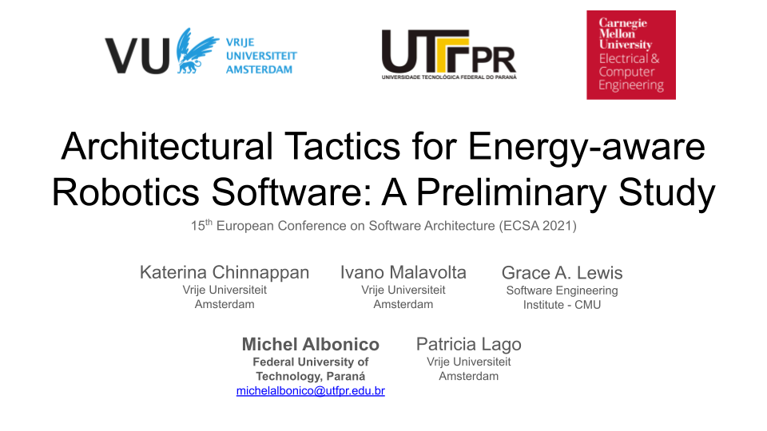

# ECSA 2021 – Replication Package

<!--[](https://doi.org/10.5281/zenodo.3672050)-->

This repository contains the replication package of the paper published at ECSA 2021 with the title **Architectural Tactics for Energy-aware Robotics Software: A Preliminary Study**.

This study has been designed, developed, and reported by the following investigators:

- [Katerina Chinnappan](http://katerinachinnppan.com/) (Vrije Universiteit Amsterdam)
- [Ivano Malavolta](https://www.ivanomalavolta.com) (Vrije Universiteit Amsterdam)
- [Patricia Lago](https://www.cs.vu.nl/~patricia/Patricia_Lago/Home.html) (Vrije Universiteit Amsterdam)
- [Michel Albonico](https://michelalbonico.github.io) (Vrije Universiteit Amsterdam/Federal University of Technology, Paraná) 
- [Grace A. Lewis](https://www.andrew.cmu.edu/user/gritter/lewis.html) (Software Engineering Institute, Carnegie Mellon University, USA)

For any information, interested researchers can contact us by sending an email to any of the investigators listed above.
The full dataset including raw data, mining scripts, and analysis scripts produced during the study are available below.

## How to Cite the Dataset
If the dataset is helping your research, consider to cite it is as follows, thanks!

```
@inproceedings{ECSA_2021_ea_tactics,
  title = { Architectural Tactics for Energy-aware Robotics Software: A Preliminary Study },
  author = { Katerina Chinnappan and Ivano Malavolta and Grace Lewis and Michel Albonico and Patricia Lago },
  pages = { To appear },
  month = { June },
  publisher = {{Springer}},
  year      = {2021},
  booktitle = { Software Architecture - 15th European Conference, {ECSA} 2021, Växjö,
               Sweden, September 13-11, 2021, Proceedings }
}
```

The preprint paper is available [here](./ecsa_2021_ea_tactics.pdf).

#### Watch our Presentation Video

[](https://www.youtube.com/watch?v=eS6-Fod7W9w)

### Overview of the Replication Package
---

This replication package is structured as follows:

```
./
    |--- dataset/     		  The full dataset of ROS-based systems mined from GitHub and the scripts used to process the data.
    |--- data_analysis/       	  Mining scripts and spreadsheets used in the manual data analysis.
    |--- ecsa_2021_ea_tactics.pdf            (not available yet)  A copy of the paper in pdf format.
```

Each of the folders listed above are described in details in the remaining of this readme.

### Dataset

All the explanation of the dataset building is in the folder [readme](./dataset/README.md).

---
```
./dataset/
  |--- include/
  	|--- helpers/				       Scripts for secondary tasks, such as reading the configuration file.
  	|--- mongodb/                                  Scripts to interact to MongoDB.
        |--- csvutils/				       Scripts to convert JSON to CSV files.
  |--- phase1/
       |--- input_data/                                
            |--- git_repos_data.json                   Markdown files and code comments (we still need to upload this to MongoDB).
       |--- output_data/                               JSON files (for each collection) containing data points with energy-related terms.
       |--- energy_mining.py                           Mining code that searches for energy-related terms.
       |--- gen_csv.sh				       Code that generates the CSV file from extracted JSONs.
       |--- energy-term-datapoints.csv                 Data points with energy terms.
  |--- phase2/
       |--- input_data/
	    |--- included-datapoints.csv               All the energy-related datapoints without dates (result from manual selection).
       |--- output_data/
            |--- energy-datapoints.csv                 List of energy-related data points with timestamps.
       |--- get_date.py	                               Gets the date of each data point (we still need to move this to Phase 1).
       |--- get_timestamp.py                           Gets the timestamp of each data point (we still need to move this to Phase 1).
  |--- phase3/
       output_data/                                    JSON files of each collection containing the possible false negatives.
       |--- get_false_negatives.py                     Searches for false-negatives.
       |--- no-energy-terms-datapoints.csv             List of data points without energy terms.
  |--- energy_terms_stats.pdf                          Summary of data points with energy terms.
  |--- mongodb-dump.tar.gz                             Dump of MongoDB database.
  |--- configuration.cfg                                  Configuration file.
  |--- requirements.txt                                Python requirements.
```

### Data Analysis

The data in the CSV files has been manually, collaboratively, and iteratively extracted by the authors of the paper.

---
```
./data_analysis/
    |--- phase3-data_points_selection/
	|--- selected_data_points.csv		Spreadsheet with the selected data points.
    |--- phase4-tactics_extraction/
        |--- extracted_tactics.csv		Spreadsheet with the extracted e-aware tactics.
```

## License

This software is licensed under the MIT License.
